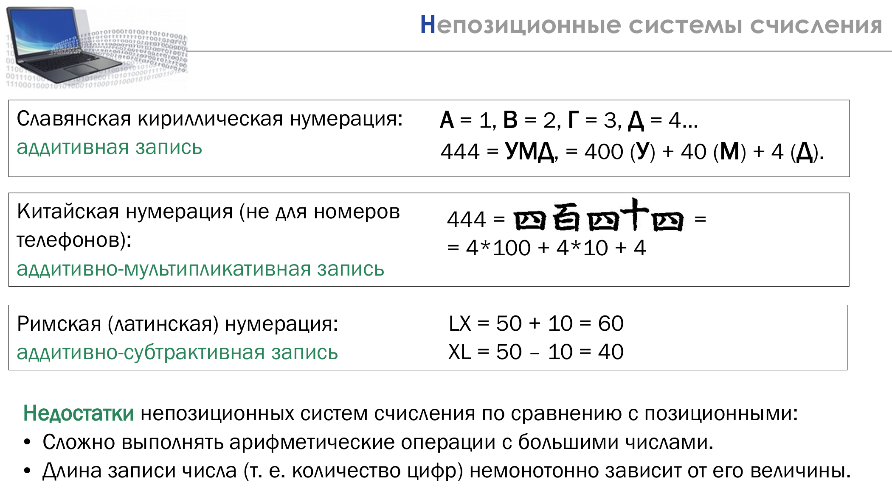
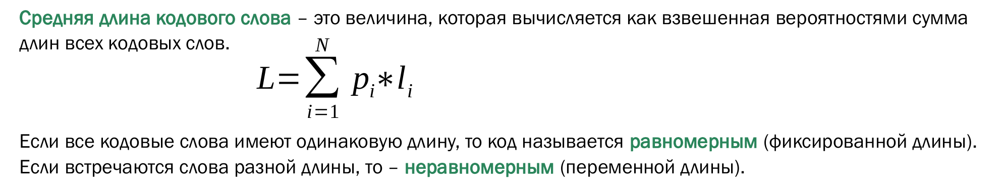
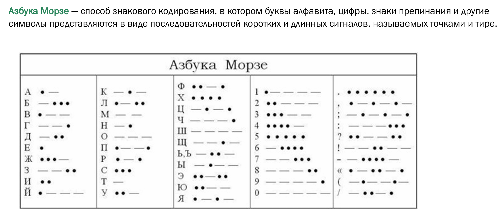

# Сжатие информации и основы помехоустойчивого кодирования

## Непозиционные системы счисления

## Способы округления

## Алфавит и его подмножества

- Алфавит – конечное множество различных знаков (букв), символов, для которых определена операция конкатенации (присоединения символа к символу или цепочке символов).
- Знак (буква) – любой элемент алфавита (элемент x алфавита X, где x є X).
- Слово – конечная последовательность знаков (букв) алфавита.
- Словарь (словарный запас) – множество различных слов над алфавитом.

## Кодировка данных

- Кодирование (модуляция) данных — процесс преобразования символов алфавита Х в символы алфавита Y.
- Декодирование (демодуляция) — процесс, обратный кодированию. 
- Символ — наименьшая единица данных, рассматриваемая как единое целое при кодировании/декодировании.
- Кодовое слово – последовательность символов из алфавита Y, однозначно обозначающая конкретный символ алфавита Х. 

## Сжатие данных

- Сжатие данных — процесс, обеспечивающий уменьшение объёма данных путём сокращения их избыточности. 
- Сжатие данных — частный случай кодирования данных.
- Коэффициент сжатия — отношение размера входного потока к выходному потоку. 
- Отношение сжатия — отношение размера выходного потока ко входному потоку.

*Пример.*
Размер входного потока равен 500 бит, выходного равен 400 бит.
- Коэффициент сжатия = 500 бит / 400 бит = 1,25.
- Отношение сжатия = 400 бит / 500 бит = 0,8.
- Случайные данные невозможно сжать, так как в них нет никакой избыточности.

## Типы и методы сжатия данных
- Сжатие без потерь (полностью обратимое) — сжатые данные после декодирования (распаковки) не отличаются от исходных.
- Сжатие с потерями (частично обратимое) — сжатые данные после декодирования (распаковки) отличаются от исходных, так как при сжатии часть исходных данных была отброшена для увеличения коэффициента cжатия.
- Статистические методы — кодирование с помощью усреднения вероятности появления элементов в закодированной последовательности.
- Словарные методы — использование статистической модели данных для разбиения данных на слова с последующей заменой на их индексы в словаре.

