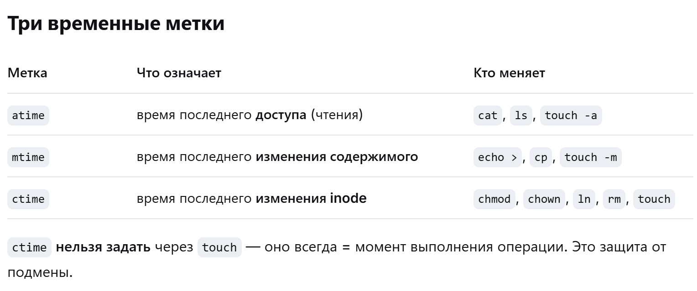

# Лаба 1

## script

Копирование скрипта без \r
```
tr -d '\r' < script.sh > scriptF.sh
```

## Команды

mkdir, echo, cat, touch, ls, pwd, cd, more, cp, mv,  chmod, ln, wc, head, tail, sort, grep, rm, rmdir

### pwd

возвращает путь, в котором сейчас пользователь

### echo

выводит текст

-n - убирает последний \n

### cat

Читает файлы последовательно и пишет в stdout. Файлы обрабатываются в порядке, указанном в командной строке.

`-` - позволяет записать пользовательский ввод
```bash
cat file1 - file2
```

| Опция | Что делает                                                             |
|-------|------------------------------------------------------------------------|
| -b    | нумеровать непустые строки, начиная с 1                                |
| -e    | показать непечатаемые символы + $ в конце каждой строки                | 
| -l    | эксклюзивная блокировка выходного файла через fcntl                    | 
| -n    | нумеровать все строки, начиная с 1                                     | 
| -s    | сжимать несколько подряд идущих пустых строк в одну                    | 
| -t    | показать непечатаемые символы + табы как ^I                            | 
| -u    | отключить буферизацию вывода                                           | 
| -v    | показать непечатаемые символы: control → ^X, DEL → ^?, non-ASCII → M-X | 


### touch

touch — команда, которая изменяет временные метки файла



| Опция                    | Что делает                                         | 
|--------------------------|----------------------------------------------------|
| -A                       | [-][[hh]mm]SS	Сдвинуть время на указанный интервал | 
| -a                       | Изменить только atime                              | 
| -c                       | Не создавать файл, если его нет                    | 
| -d YYYY-MM-DDThh:mm:SS   | Задать время человекочитаемо                       | 
| -h                       | Если симлинк — менять время ссылки, а не цели      | 
| -m                       | Изменить только mtime                              | 
| -r file                  | Взять atime/mtime у файла-образца                  | 
| -t [[CC]YY]MMDDhhmm[.SS] | Задать время в числовом формате                    | 


### ls

-l
-1
-C
-R
-d
-a
-i

### wc

| Опция | Что делает                       |
|-------|----------------------------------|
| -L    | Длина самой длинной строки       |
| -c    | Количество байтов в каждом файле |  
| -l    | Количество строк                 |  
| -m    | Количество символов              |  
| -w    | Количество слов                  |  

### chmod

Изменение прав

```
chmod [who][operator][permissions] файл
```

Где:

- [who] — указывает, к кому применяются изменения:
  - u — владелец файла;
  - g — группа файла;
  - o — остальные пользователи (не владелец и не входящие в группу);
  - a — все пользователи (заменяет собой ugo).
- [operator] — определяет действие:
  - \+ — добавить разрешение;
  - \- — удалить разрешение;
  - = — установить разрешение точно (заменить текущие права).
- [permissions] — определяет, какие именно разрешения изменяются:
  - r — чтение;
  - w — запись;
  - x — выполнение.

```
chmod o=r lab0
```

```
chmod 777 lab0
```

### touch

### echo

### cat

### ln

### head

### man grep